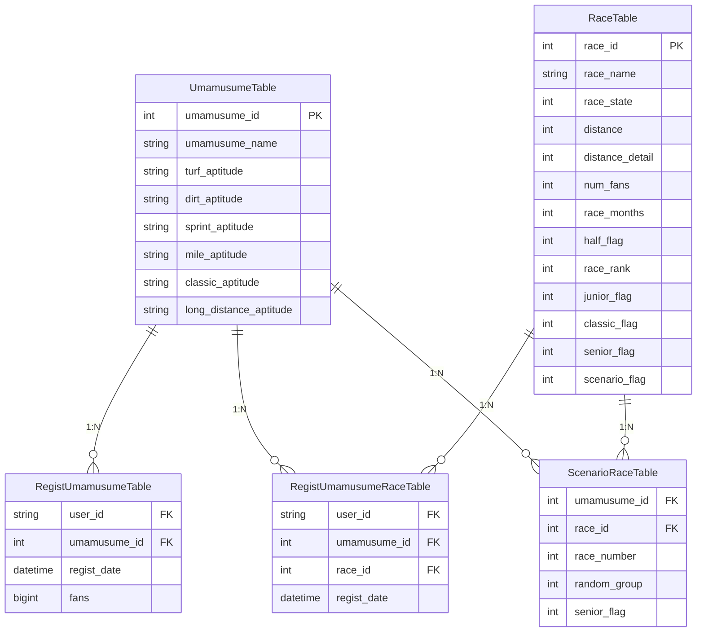

# アーキテクチャ

## システム構成図

```
                    ユーザー (ブラウザ)
                          │
                       Route53
                          │
                         ACM
                          │
                     CloudFront
                     ┌────┴────┐
                     │         │
                    S3       /api/*
                  (静的)        │
                           EC2 (t3.small)
                           ┌────┴────────────────┐
                          ECS                  Docker
                           │                    │
                       NestJS              PostgreSQL
                      (タスク)            (コンテナ + EBS)
```

CloudFront がエントリポイントとなり、静的ファイル（Angular ビルド成果物）は S3 から配信、
`/api/*` へのリクエストは EC2 上の ECS（NestJS）に転送します。

## アプリケーション内部構成

```
┌─────────────────────────────────────────────────────────┐
│                     Client (Browser)                    │
└──────────────────────────┬──────────────────────────────┘
                           │
┌──────────────────────────▼──────────────────────────────┐
│              Frontend (nginx / Angular)                 │
│  ┌─────────────┐  ┌──────────────┐  ┌───────────────┐  │
│  │  AuthGuard   │  │  HttpClient  │  │   Cognito SDK │  │
│  │  (Router)    │  │ (Interceptor)│  │  (SignIn/Up)  │  │
│  └─────────────┘  └──────┬───────┘  └───────────────┘  │
└──────────────────────────┼──────────────────────────────┘
                  /api/*   │  CloudFront → EC2
┌──────────────────────────▼──────────────────────────────┐
│               Backend (NestJS)                          │
│  ┌──────────┐  ┌───────────┐  ┌──────────────────────┐  │
│  │AuthGuard │  │ Cognito   │  │  Feature Modules     │  │
│  │(Global)  │──│ Verifier  │  │  ┌────────────────┐  │  │
│  └──────────┘  └───────────┘  │  │  Umamusume     │  │  │
│                               │  │  Race           │  │  │
│                               │  │  RacePattern    │  │  │
│                               │  └────────────────┘  │  │
│                               └──────────┬───────────┘  │
│                                          │ Prisma ORM   │
└──────────────────────────────────────────┼──────────────┘
┌──────────────────────────────────────────▼──────────────┐
│                   PostgreSQL 16                         │
└─────────────────────────────────────────────────────────┘
```

フロントエンドとバックエンドで TypeScript + `@shared/types` を共有し API の型安全性を担保。
認証は Amazon Cognito に委譲し、バックエンドでは JWT トークンの検証のみを行うステートレスな構成です。

## プロジェクト構成

```
uma-crown-simulator/
├── frontend/                        # Angular フロントエンド
│   ├── src/app/
│   │   ├── core/                    # アプリケーション基盤
│   │   │   ├── guards/auth.guard.ts          # 認証ルートガード
│   │   │   ├── interceptors/auth.interceptor.ts  # JWT 自動付与
│   │   │   └── services/
│   │   │       ├── auth.service.ts      # Cognito 認証 (Signal ベース)
│   │   │       ├── character.service.ts # ウマ娘 CRUD API クライアント
│   │   │       ├── navigation.service.ts# 画面遷移状態管理 (Signal ベース)
│   │   │       └── race.service.ts      # レース API クライアント
│   │   ├── features/                # 機能モジュール (遅延読み込み)
│   │   │   ├── auth/                # ログイン・ユーザー登録・パスワードリセット
│   │   │   │   ├── login/
│   │   │   │   ├── register/
│   │   │   │   └── forgot-password/
│   │   │   ├── landing/             # ランディングページ
│   │   │   ├── character-regist/    # ウマ娘登録
│   │   │   ├── character-list/      # 登録済みウマ娘一覧
│   │   │   ├── race-list/           # レース一覧
│   │   │   └── remaining-race/      # 残レース管理・育成パターン提案
│   │   └── shared/components/       # 共有 UI コンポーネント
│   │       ├── toast/               # トースト通知
│   │       ├── sidebar/             # サイドバーナビゲーション
│   │       └── aptitude-badge/      # 適性ランクバッジ
│   ├── test/unit/                   # Vitest 単体テスト
│   ├── nginx.conf                   # 本番用リバースプロキシ設定
│   └── Dockerfile.prod              # 本番用マルチステージビルド
│
├── backend/                         # NestJS バックエンド
│   ├── src/
│   │   ├── common/                  # 横断的関心事
│   │   │   ├── cognito/             # Cognito JWT 検証
│   │   │   ├── guards/              # グローバル認証ガード
│   │   │   ├── decorators/          # @CurrentUser(), @Public()
│   │   │   └── prisma/              # Prisma クライアント
│   │   ├── auth/                    # 認証エンドポイント
│   │   ├── umamusume/               # ウマ娘 CRUD
│   │   ├── race/                    # レース管理・パターン生成
│   │   ├── health/                  # ヘルスチェック
│   │   └── seed/                    # 初期データ投入
│   ├── test/
│   │   ├── unit/                    # Jest 単体テスト
│   │   └── e2e/                     # Jest + Supertest E2E テスト
│   └── prisma/schema.prisma         # データベーススキーマ
│
├── shared/                          # 共有パッケージ (@uma-crown/shared)
│   └── types/
│       ├── domain.ts                # ドメインモデル型定義
│       ├── api.ts                   # API リクエスト/レスポンス型定義
│       └── index.ts
│
├── terraform/                       # IaC (Terraform)
├── docs/                            # ドキュメント
├── docker-compose.yml               # 開発環境
└── package.json                     # npm workspaces ルート
```

## モジュール詳細

### `shared/` — 共有型定義パッケージ

npm workspaces で `@uma-crown/shared` として公開。フロントエンド・バックエンド間で共通の
インターフェースを定義し、API の入出力に対する型安全性を保証します。

主な型: `Umamusume`, `Race`, `RemainingRace`, `RacePattern`, `RaceSlot`, `LoginRequest`, `AuthResponse` 等

### `frontend/src/app/core/` — アプリケーション基盤層

認証に関する横断的関心事を集約。`AuthService` は Angular Signals でトークン状態をリアクティブに管理し、
`HttpInterceptor` が全リクエストに Bearer トークンを自動付与します。

### `frontend/src/app/features/` — 機能モジュール群

各機能は遅延読み込み (Lazy Loading) で分割され、初期バンドルサイズを最適化しています。

| モジュール | 概要 |
|-----------|------|
| `landing/` | 未ログイン時のトップページ |
| `auth/` | Cognito ベースのログイン・ユーザー登録・パスワードリセット |
| `character-regist/` | 未登録ウマ娘の選択と初期レース完了状態の一括登録 |
| `character-list/` | 登録済みウマ娘の一覧と適性情報のビジュアル表示 |
| `race-list/` | 全レース一覧（馬場・距離フィルタ付き、未認証でもアクセス可） |
| `remaining-race/` | 全冠達成に向けた残レース管理・育成パターン提案・手動レース登録 |

### `backend/src/common/` — 横断的関心事

`@Public()` デコレータで個別エンドポイントの認証スキップを宣言的に制御します。

### `backend/src/race/` — レース管理モジュール

本アプリケーションのコアロジック。`RacePatternService` が全冠達成に向けた育成ローテーションを生成します。
詳細は [algorithm.md](algorithm.md) を参照。

## ER図


